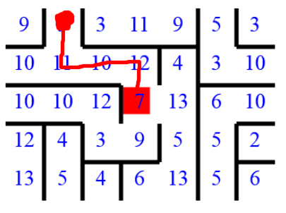
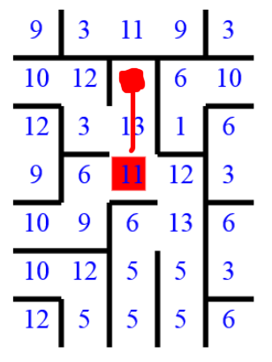

# Lost

## Description

You are **LOST**! You were on your way to the **JavaScript Fundamentals Exam** when suddenly a wild **banda** consisting of **zdravi batki** kidnapped you.
They put you in the center of a **maze** (a labyrinth, not a cellar full of **wine**, **turshiya** and **rakiya**). The **batki** will chase you and you'll have to escape from the **maze** and from them.


The **maze** has **R** rows and **C** columns. You always start from the cell in the middle of the **maze** (**R** and **C** will always be odd integer numbers).
From any cell, you will always first try to go **up**, if you cannot go up, try to go **right**, if you cannot go right, try to go **down**, if you cannot go down, try going **left**.
If you cannot go left, that means you cannot go anywhere - the **batki** will catch you and have you brew bottles of **rakiya** for them - then you won't be able to go to the **JavaScript Fundamentals Exam** in time.
You should stop running and print **`No JavaScript, only rakiya ROW COLUMN`**, where **ROW** is the row number where you're stuck and **COLUMN** is the column where you're stuck.

**You can only move to an adjacent cell if there is no wall between your current cell and the destination cell and you haven't visited the destination cell before.**
If a step puts you out of the **maze**, you escape the **batki** and should print **`No rakiya, only JavaScript ROW COLUMN`** where **ROW** is the row number of the cell you escaped from and **COLUMN** is the number of the column of the cell you escaped from.

### Where can you go from each cell?

Each cell will contain an integer number in the range [0..15] inclusive. The bits of the number represent whether you can move in a given direction.
If a bit at a position is **1**, you can move in that direction. Below are the positions and their respective directions.

| Position | Direction | Explanation |
| :--- | :--- | :--- |
| 0 | up | If the bit at the position is **1**, you can move **up** |
| 1 | right | If the bit at the position is **1**, you can move **right** |
| 2 | down | If the bit at the position is **1**, you can move **down** |
| 3 | left | If the bit at the position is **1**, you can move **left** |

#### Examples

| Cell value | Binary representation | Possible directions |
| :--- | ---: | :--- |
| 1 | 0001 | only up |
| 7 | 0111 | up, right and down |
| 10 | 1010 | right and left |
| 15 | 1111 | all directions |

## Input

* As the first input element, you will receive the number **R** and **C**, separated by a space - the dimensions of the **maze**.
* The next **R** elements will be the rows of the **maze** - you will receive numbers separated by a space. Each number represents a cell.
* See the sample tests for more details.

## Output

* You should output a single line as described above. Both `console.log` and `return` are a valid way of outputting.
* See the sample tests for more details.

## Constraints

* 5 <= **R** <= 90
* 5 <= **C** <= 90
* **R** and **C** will always be odd numbers
* All numbers - **R**, **C** and all cell values will always be integer values.
* The cells will never contain numbers larger than 15 or lesser than 1.
* The input will **always** be valid and in the described format. There is no need for you to check it explicitly.
* You cannot visit the same cell twice (see sample test #2).

## Sample tests

### Sample test 1

#### Input

```
[
    '5 7',
    '9 5 3 11 9 5 3',
    '10 11 10 12 4 3 10',
    '10 10 12 7 13 6 10',
    '12 4 3 9 5 5 2',
    '13 5 4 6 13 5 6'
]
```

#### Output

```
No rakiya, only JavaScript 0 1
```


### Sample test 2

#### Input

```
[
    '7 5',
    '9 3 11 9 3',
    '10 12 4 6 10',
    '12 3 13 1 6',
    '9 6 11 12 3',
    '10 9 6 13 6',
    '10 12 5 5 3',
    '12 5 5 5 6'
]
```

#### Output

```
No JavaScript, only rakiya 1 2
```


